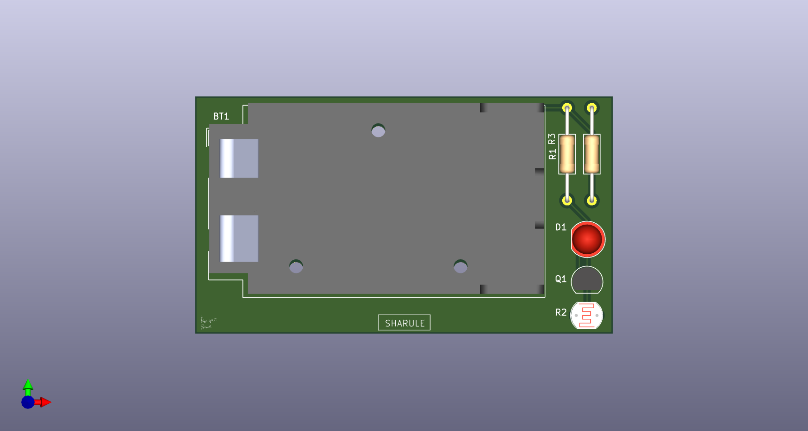
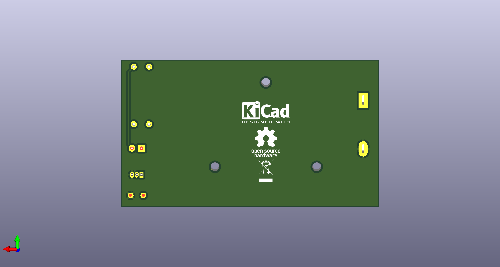
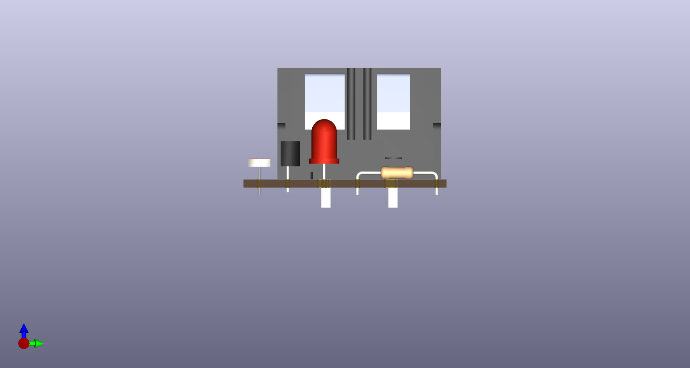
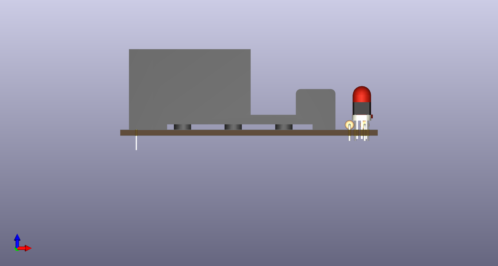

# LDR Night Lamp PCB

A PCB design project for an **LDR (Light Dependent Resistor) based Automatic Night Lamp** created using **KiCad 9**. The circuit automatically switches an LED on in low-light conditions and turns it off when sufficient ambient light is available.

This repository documents the complete PCB design workflow from schematic capture to PCB layout and manufacturing-ready files.

---

## Features

* Automatic light detection using an LDR
* 9V battery powered
* Through-hole components
* Front and back silkscreen graphics
* Ground copper pour
* ERC and DRC verified

---

## Project Overview

The circuit uses an **LDR** and a resistor to create a voltage divider that senses ambient light. An **NPN transistor** acts as a switch to control the LED.

### Operation

#### Bright Environment

* LDR resistance is low.
* The transistor remains OFF.
* LED remains OFF.

#### Dark Environment

* LDR resistance increases.
* The transistor turns ON.
* LED turns ON automatically.

---

## Repository Structure

```text
LDR-Night-Lamp-PCB/
│
├── kicad/
│   └── LDR_Night_Lamp/
│       ├── LDR_Night_Lamp.kicad_pro
│       ├── LDR_Night_Lamp.kicad_sch
│       └── LDR_Night_Lamp.kicad_pcb
│
├── docs/
├── README.md
└── .gitignore
```

---

## Hardware Used

| Component              |    Quantity |
| --------------------   | ----------: |
| LDR                    |           1 |
| LED                    |           1 |
| NPN Transistor         |           1 |
| Resistors(100kΩ,470Ω)  |     1 x each|
| 9V Battery Connector   |           1 |

---

## Design Verification

Before releasing the PCB:

* ✔ Electrical Rules Check (ERC)
* ✔ Design Rules Check (DRC)
* ✔ Footprint assignment completed
* ✔ PCB routing completed
* ✔ Ground copper pour added
* ✔ Front and back silkscreen finalized

---

## Documentation

The `docs/` folder contains screenshots and visual documentation of the project. These images provide an overview of the PCB design and are used throughout this README for better visualization.

Current documentation includes:

* Schematic
* PCB Layout
* 3D Top View
* 3D Bottom View
* 3D Front View
* 3D Side View

---

## Screenshots

### Schematic


### PCB Layout


### 3D Top View



### 3D Bottom View



### 3D Front View



### 3D Side View



---

## Manufacturing Files

*To be added.*

---

## Releases

*To be added.*

---
