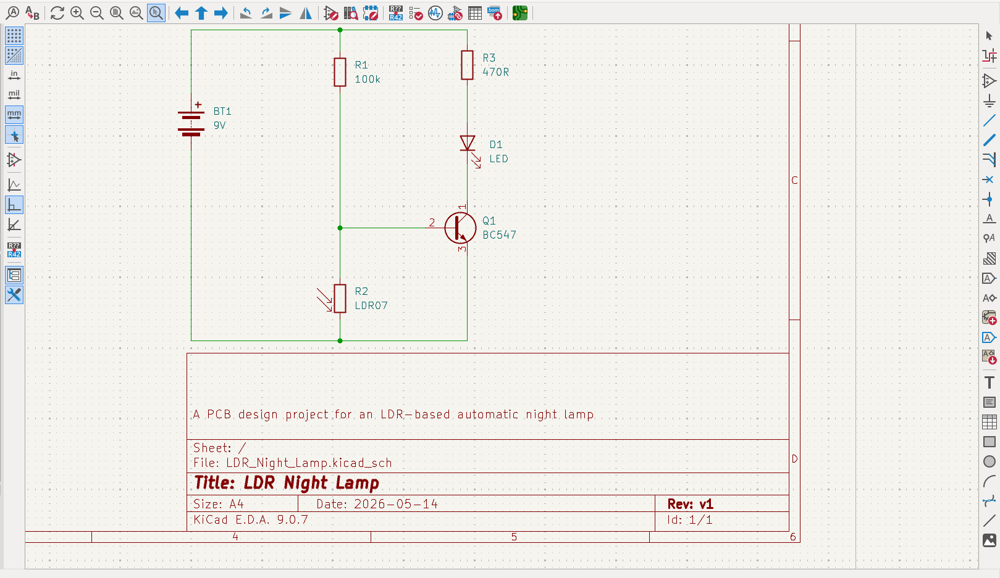
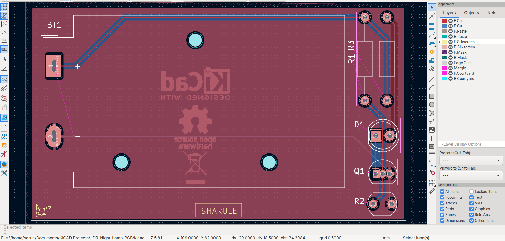

# LDR Night Lamp PCB

A PCB design project for an **LDR (Light Dependent Resistor) based Automatic Night Lamp** created using **KiCad 9**. The circuit automatically switches an LED on in low-light conditions and turns it off when sufficient ambient light is available.

This repository documents the complete PCB design workflow from schematic capture to PCB layout and manufacturing-ready files.

---

## Features

* Automatic light detection using an LDR
* 9V battery powered
* Through-hole components
* Front and back silkscreen graphics
* Ground copper pour
* ERC and DRC verified

---

## Project Overview

The circuit uses an **LDR** and a resistor to create a voltage divider that senses ambient light. An **NPN transistor** acts as a switch to control the LED.

### Operation

#### Bright Environment

* LDR resistance is low.
* The transistor remains OFF.
* LED remains OFF.

#### Dark Environment

* LDR resistance increases.
* The transistor turns ON.
* LED turns ON automatically.

---

## Repository Structure

```text
LDR-Night-Lamp-PCB/
│
├── docs/
│   ├── images/                          # Project screenshots used in the README
│   └── tutorials/                       # Project guides and workflow documentation
│
├── kicad/
│   └── LDR_Night_Lamp/
│       ├── LDR_Night_Lamp.kicad_pro
│       ├── LDR_Night_Lamp.kicad_sch
│       └── LDR_Night_Lamp.kicad_pcb
│
├── Production/
│   ├── BOM/
│   ├── gerber_and_drill
│   ├── PDF/
│   ├── position/
│   └── STEP/
│
├── README.md
└── .gitignore
```

---

## Hardware Used

| Component              |    Quantity |
| --------------------   | ----------: |
| LDR                    |           1 |
| LED                    |           1 |
| NPN Transistor         |           1 |
| Resistors(100kΩ,470Ω)  |     1 x each|
| 9V Battery Connector   |           1 |

---

## Design Verification

Before releasing the PCB:

* ✔ Electrical Rules Check (ERC)
* ✔ Design Rules Check (DRC)
* ✔ Footprint assignment completed
* ✔ PCB routing completed
* ✔ Ground copper pour added
* ✔ Front and back silkscreen finalized

---

## Documentation

The `docs/` folder contains project documentation and visual assets.

* **images/** – Screenshots of the schematic, PCB layout, and 3D views used throughout this README.
* **tutorials/** – Markdown guides documenting the complete KiCad design workflow, Git/GitHub version control process, and manufacturing file generation.

---

## Screenshots

### Schematic



### PCB Layout



### 3D Top View


### 3D Bottom View


### 3D Front View


### 3D Side View


---

## Manufacturing Files

*To be added.*

---

## Releases

*To be added.*

---

